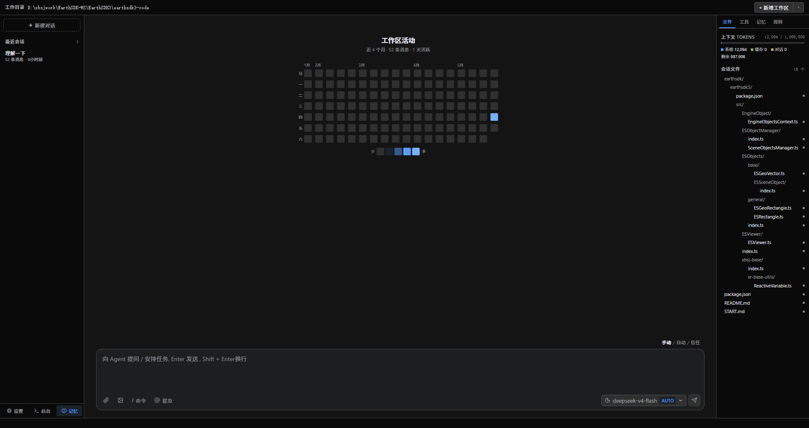

# Reasonix Desktop (Electron + Vue 3)

> [English](./README.md)

**Reasonix** 的桌面客户端 — 基于 Electron + Vue 3 + Element Plus 构建。
本项目是 [原版 Tauri + React 桌面端](https://github.com/esengine/DeepSeek-Reasonix/tree/main/desktop) 的移植版本，保留核心功能，极致简化。

<p align="center">
  
</p>

## 技术栈

| 层 | 技术 |
|---|---|
| 框架 | Electron 38 |
| 前端 | Vue 3 + TypeScript + Pinia |
| UI 组件库 | Element Plus 2.x |
| 国际化 | vue-i18n（简体中文 / English） |
| Markdown | markdown-it |
| 构建 | electron-vite + tsup |
| 代码检查 | ESLint + Prettier |
| 运行环境 | Node ≥ 22 |

## 功能特性

- **AI 对话** — 流式输出，支持文本 / 推理过程 / 工具调用分段展示
- **RPC 子进程** — 启动 Reasonix CLI 作为托管子进程，通过 stdin/stdout JSON 行协议通信
- **工作目录管理** — 设置和切换工作目录，文件系统操作限定在工作区范围内
- **会话历史** — 浏览、加载、删除历史会话
- **命令面板**（`Ctrl+K`）— 快速访问所有操作
- **后台任务**（`Ctrl+J`）— 监控运行中和已退出的子进程
- **MCP 服务器配置** — 添加、删除和查看 MCP 服务器规格
- **技能面板** — 浏览和调用已安装的技能
- **预设切换** — 快速在 auto / flash / pro 预设间切换
- **编辑模式** — 手动审查 / 自动 / 完全信任三种文件变更审批模式
- **主题系统** — 深色 / 浅色 + 4 种风格（石墨、砂岩、瓷白、午夜）+ 字号 / 字体自定义
- **@-提及文件** — 文件路径自动补全，支持目录浏览
- **斜杠命令** — 内联命令如 `/new`、`/clear`、`/abort`、`/retry` 等

## 架构

```
┌──────────────────────────────────────────────────┐
│  渲染进程  (Vue 3 + Element Plus)                │
│  ┌──────────┬──────────────────┬──────────────┐  │
│  │ Sidebar  │   Thread (对话)  │  Settings    │  │
│  │ 侧边栏   │   + Composer     │  设置/任务   │  │
│  └──────────┴──────────────────┴──────────────┘  │
│         ↕ contextBridge (window.api)              │
├──────────────────────────────────────────────────┤
│  主进程  (Electron)                              │
│  ┌──────────┬──────────┬──────────────────────┐  │
│  │ 窗口管理  │ IPC      │ RPC 子进程管理       │  │
│  │          │ 处理器   │ (spawn/send/kill     │  │
│  │          │          │  reasonix CLI)       │  │
│  └──────────┴──────────┴──────────────────────┘  │
│         ↕ stdin/stdout JSON 行                    │
├──────────────────────────────────────────────────┤
│  CLI 子进程  (Reasonix)                          │
│  ┌──────────────────────────────────────────────┐│
│  │  LLM 调用 · 工具执行 · 文件系统操作          ││
│  └──────────────────────────────────────────────┘│
└──────────────────────────────────────────────────┘
```

## 快速开始

### 环境要求

- **Node.js** ≥ 22
- **npm** ≥ 10

### 安装

```bash
git clone <仓库地址>
cd test-app
npm install
```

### 开发

```bash
npm run dev
```

启动 Electron 应用，渲染进程支持热重载。

### 构建

```bash
# Windows 安装包
npm run build:win

# macOS（需要签名）
npm run build:mac

# Linux AppImage
npm run build:linux

# 解包目录（测试用）
npm run build:unpack
```

### 类型检查

```bash
npm run typecheck        # 全部
npm run typecheck:node   # 主进程
npm run typecheck:web    # 渲染进程
```

## 项目结构

```
src/
├── main/              # Electron 主进程
│   ├── index.ts       # 窗口创建 + IPC 处理器
│   ├── rpc.ts         # Reasonix CLI 子进程管理
│   ├── commands.ts    # 文件系统命令（目录树、git、编辑器、写入）
│   └── protocol.ts    # 事件 / 命令类型定义
├── preload/
│   └── index.ts       # contextBridge 向渲染进程暴露 api
└── renderer/src/
    ├── App.vue        # 根布局
    ├── main.ts        # Vue 应用启动（Pinia、i18n、Element Plus）
    ├── stores/
    │   ├── session.ts # 会话状态机 + RPC 事件处理
    │   ├── settings.ts# 设置状态
    │   ├── theme.ts   # 主题 / 字体 / 字号（localStorage 持久化）
    │   └── app.ts     # 全局状态（会话列表、任务、MCP、技能）
    └── components/
        ├── Thread.vue       # 消息线程（分段渲染）
        ├── Composer.vue     # 输入区域（命令 / 提及 / 模型切换）
        ├── Sidebar.vue      # 会话列表 + 导航
        ├── StatusBar.vue    # 底部状态栏
        ├── TopBar.vue       # 工作目录栏
        ├── Markdown.vue     # Markdown 渲染（markdown-it）
        ├── CommandPalette.vue # Ctrl+K 命令面板
        ├── JobsPop.vue       # Ctrl+J 后台任务弹窗
        ├── Settings.vue      # 设置对话框（通用/模型/MCP/技能）
        ├── WorkdirPop.vue    # 工作目录选择
        ├── Splash.vue        # 启动欢迎屏
        ├── AboutModal.vue    # 关于弹窗
        └── cards/
            ├── ToolCard.vue       # 工具调用卡片
            ├── ShellCard.vue      # Shell 命令卡片
            ├── ReasoningCard.vue  # 推理过程卡片
            └── ApprovalCards.vue  # 审批/计划/选择/检查点卡片

scripts/
└── init.mjs           # 安装后脚本（下载 Node + 验证 reasonix）
```

## 与原版的对比

本项目是 [Reasonix Desktop (Tauri + React)](https://github.com/esengine/DeepSeek-Reasonix/tree/main/desktop) 的 **功能移植** 版本。共享相同的 RPC 协议和 Reasonix CLI 后端，但替换了前端技术栈：

| 原版 | 本移植版 |
|---|---|
| Tauri 2（Rust） | Electron 38 |
| React + TypeScript | Vue 3 + TypeScript + Pinia |
| CSS 自定义属性（oklch） | Element Plus 设计令牌 |
| prism-react-renderer | markdown-it |
| lucide-react 图标 | 内联 SVG 图标 + Element Plus 图标 |

## 许可证

[MIT](./LICENSE)
